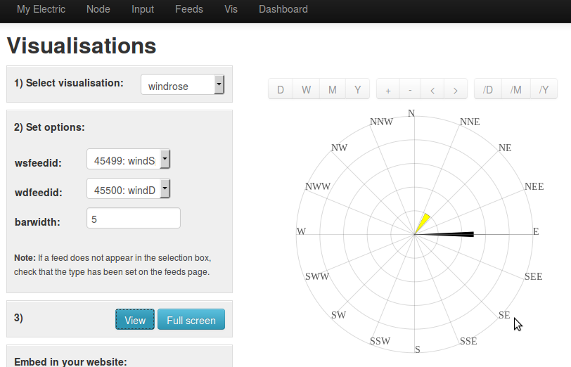
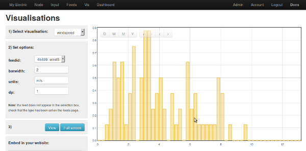

# emoncms-wind-visualizations
how to add wind visualizations in emoncms

**work is not finnish, test it, but I need some help to clean displays and code.**

The goal is to propose new vizualisations for emoncms.

## Process

In process repository you can find new versions of process_model.php and process_info.js. This add two process :
 - Log wind direction :
Convert degre in axis position (ex: N=0,E=90,S=180,W=270). The argument is the number of columns (8,16,32).

 - Log wind speed frequency :
Convert the wind speed value to a column. (each column = 0,25 m/s)

## Wind rose

## Distribution of wind speed frequencies.

